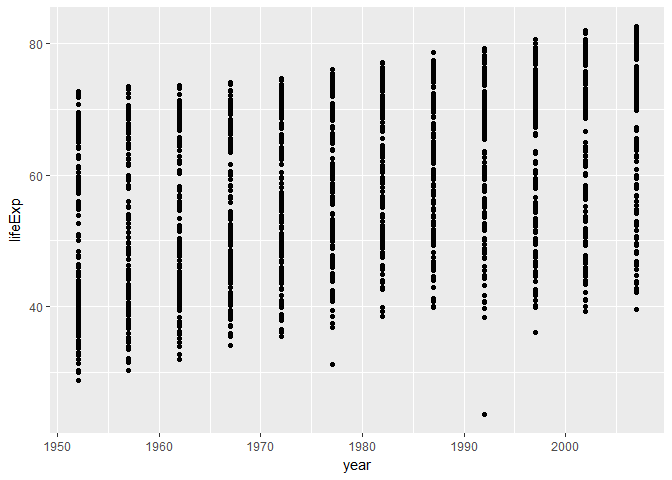

# HW_02
DJames  
September 26, 2017  


## Gapminder dataset

```r
library(gapminder)
library(tidyverse)
```

```
## Loading tidyverse: ggplot2
## Loading tidyverse: tibble
## Loading tidyverse: tidyr
## Loading tidyverse: readr
## Loading tidyverse: purrr
## Loading tidyverse: dplyr
```

```
## Conflicts with tidy packages ----------------------------------------------
```

```
## filter(): dplyr, stats
## lag():    dplyr, stats
```


```r
class(gapminder)
```

```
## [1] "tbl_df"     "tbl"        "data.frame"
```

```r
str(gapminder)
```

```
## Classes 'tbl_df', 'tbl' and 'data.frame':	1704 obs. of  6 variables:
##  $ country  : Factor w/ 142 levels "Afghanistan",..: 1 1 1 1 1 1 1 1 1 1 ...
##  $ continent: Factor w/ 5 levels "Africa","Americas",..: 3 3 3 3 3 3 3 3 3 3 ...
##  $ year     : int  1952 1957 1962 1967 1972 1977 1982 1987 1992 1997 ...
##  $ lifeExp  : num  28.8 30.3 32 34 36.1 ...
##  $ pop      : int  8425333 9240934 10267083 11537966 13079460 14880372 12881816 13867957 16317921 22227415 ...
##  $ gdpPercap: num  779 821 853 836 740 ...
```


```r
ncol(gapminder)
```

```
## [1] 6
```


```r
nrow(gapminder)
```

```
## [1] 1704
```


```r
dim(gapminder)
```

```
## [1] 1704    6
```


```r
summary(gapminder)
```

```
##         country        continent        year         lifeExp     
##  Afghanistan:  12   Africa  :624   Min.   :1952   Min.   :23.60  
##  Albania    :  12   Americas:300   1st Qu.:1966   1st Qu.:48.20  
##  Algeria    :  12   Asia    :396   Median :1980   Median :60.71  
##  Angola     :  12   Europe  :360   Mean   :1980   Mean   :59.47  
##  Argentina  :  12   Oceania : 24   3rd Qu.:1993   3rd Qu.:70.85  
##  Australia  :  12                  Max.   :2007   Max.   :82.60  
##  (Other)    :1632                                                
##       pop              gdpPercap       
##  Min.   :6.001e+04   Min.   :   241.2  
##  1st Qu.:2.794e+06   1st Qu.:  1202.1  
##  Median :7.024e+06   Median :  3531.8  
##  Mean   :2.960e+07   Mean   :  7215.3  
##  3rd Qu.:1.959e+07   3rd Qu.:  9325.5  
##  Max.   :1.319e+09   Max.   :113523.1  
## 
```


```r
typeof(gapminder)
```

```
## [1] "list"
```

```r
summary(gapminder$continent)
```

```
##   Africa Americas     Asia   Europe  Oceania 
##      624      300      396      360       24
```

```r
range(gapminder$lifeExp)
```

```
## [1] 23.599 82.603
```

```r
y <- gapminder$lifeExp
hist(y)
```

<!-- -->

```r
summary(y)
```

```
##    Min. 1st Qu.  Median    Mean 3rd Qu.    Max. 
##   23.60   48.20   60.71   59.47   70.85   82.60
```

```r
x <- gapminder$year
plot(x, y)
```

<!-- -->

```r
ggplot(gapminder, aes(x=year, y=lifeExp)) +
    geom_point()
```

<!-- -->

```r
gapminder %>%
    filter(country=="Canada") %>% 
    arrange(year) %>% 
    ggplot(aes(pop, gdpPercap, color=year)) +
    geom_point()
```

<!-- -->

## Reflections

For this assignment, I had issues with matching my remote repo and my local working directory. My RProj file got stored in a separate file from my rmd and md files, which was a bit of a nightmare. In the end, I created a new working repo and new local folder and relinked the two, which solved the problem. But, it was definitely super frustrating and took a long time to maneuver! I think it's worth hammering home to students how important it is to have a logical file organization and to emphasize that your RProj file shouldn't ever be moved to avoid headaches like mine! It's these basic functions that seem easy, but if they happen to go awry then all of the work you do to follow is made that much harder/more time-consuming.
