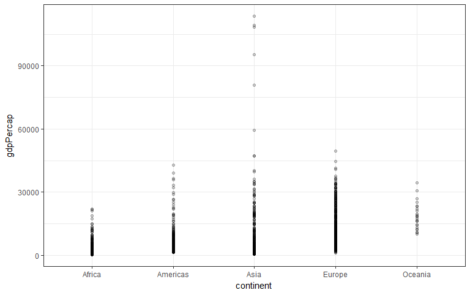
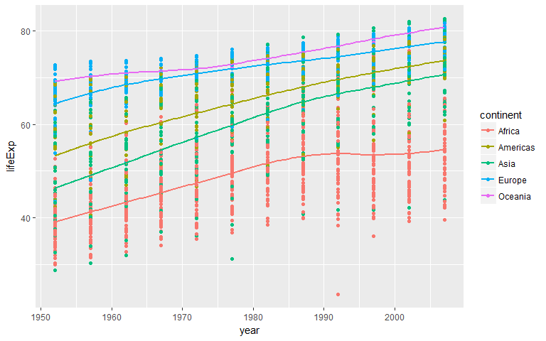
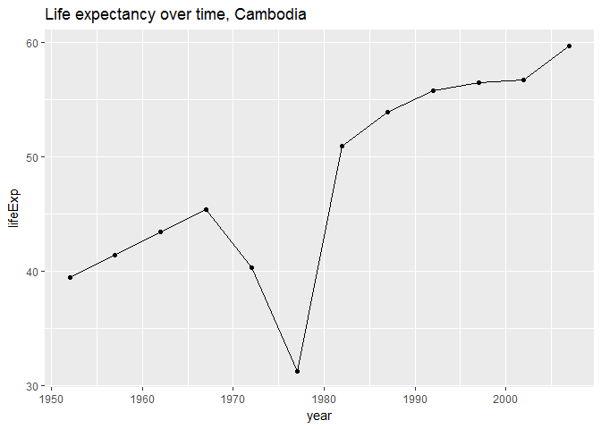

# HW03_rmd
DJames  
October 1, 2017  


## Downloading the Gapminder and Tidyverse packages


```r
library(gapminder)
library(tidyverse)
```

```
## Loading tidyverse: ggplot2
## Loading tidyverse: tibble
## Loading tidyverse: tidyr
## Loading tidyverse: readr
## Loading tidyverse: purrr
## Loading tidyverse: dplyr
```

```
## Conflicts with tidy packages ----------------------------------------------
```

```
## filter(): dplyr, stats
## lag():    dplyr, stats
```

## Exploring the Gapminder dataset

Let's check the overall strucure of the dataset, including overall (global) minimum and maximum GDP per capita:


```r
str(gapminder)
```

```
## Classes 'tbl_df', 'tbl' and 'data.frame':	1704 obs. of  6 variables:
##  $ country  : Factor w/ 142 levels "Afghanistan",..: 1 1 1 1 1 1 1 1 1 1 ...
##  $ continent: Factor w/ 5 levels "Africa","Americas",..: 3 3 3 3 3 3 3 3 3 3 ...
##  $ year     : int  1952 1957 1962 1967 1972 1977 1982 1987 1992 1997 ...
##  $ lifeExp  : num  28.8 30.3 32 34 36.1 ...
##  $ pop      : int  8425333 9240934 10267083 11537966 13079460 14880372 12881816 13867957 16317921 22227415 ...
##  $ gdpPercap: num  779 821 853 836 740 ...
```

```r
min(gapminder$gdpPercap)
```

```
## [1] 241.1659
```

```r
max(gapminder$gdpPercap)
```

```
## [1] 113523.1
```

Now let's get the minimum and maximum GDP per capita by continent using dplyr:


```r
gapminder %>% group_by(continent) %>%
     summarize(min = min(gdpPercap),
               max = max(gdpPercap))
```

```
## # A tibble: 5 x 3
##   continent        min       max
##      <fctr>      <dbl>     <dbl>
## 1    Africa   241.1659  21951.21
## 2  Americas  1201.6372  42951.65
## 3      Asia   331.0000 113523.13
## 4    Europe   973.5332  49357.19
## 5   Oceania 10039.5956  34435.37
```


We can see that the global minimum GDP per capita can be attributed to Africa, while the maximum GDP per capita can be attributed to Asia.


```r
ggplot(gapminder, aes(continent, gdpPercap)) +
    geom_point(alpha=0.2) +
    geom_smooth(se=FALSE, span=0.5) +
  theme_bw()
```

```
## `geom_smooth()` using method = 'loess'
```

<!-- -->


Obviously, we could calcualte the spread of GDP per capita within the continents manually based on the above information, or we could query the dataset further to do it for us:


```r
gapminder %>% group_by(continent) %>%
     summarize(range = max(gdpPercap) - min(gdpPercap))
```

```
## # A tibble: 5 x 2
##   continent     range
##      <fctr>     <dbl>
## 1    Africa  21710.05
## 2  Americas  41750.02
## 3      Asia 113192.13
## 4    Europe  48383.66
## 5   Oceania  24395.77
```


Let's try to calculate weighted mean of life expectancy by poplation (borrowing code described by jaradniemi in [this thread](https://stackoverflow.com/questions/23502697/r-weighted-arithmetic-mean)):


```r
gapminder %>%
   group_by(continent) %>%
  summarise(mean = mean(lifeExp), wmean = weighted.mean(lifeExp, pop))
```

```
## # A tibble: 5 x 3
##   continent     mean    wmean
##      <fctr>    <dbl>    <dbl>
## 1    Africa 48.86533 50.59279
## 2  Americas 64.65874 69.50691
## 3      Asia 60.06490 61.11856
## 4    Europe 71.90369 72.30718
## 5   Oceania 74.32621 75.48954
```


```r
ggplot(gapminder, aes(year, lifeExp, color=continent)) +
    geom_point() +
    geom_smooth(se=FALSE, span=0.5)
```

```
## `geom_smooth()` using method = 'loess'
```

<!-- -->


Now let's figure out median worldwide life expectancy...

```r
median(gapminder$lifeExp)
```

```
## [1] 60.7125
```


...and determine how many countries on each continent have a life expectancy less than the median, for each year:

```r
my.df4 <- gapminder %>% 
arrange(year, continent, country) %>% 
  filter(lifeExp < 60.7)
knitr::kable(my.df4)
```


country                    continent    year    lifeExp         pop     gdpPercap
-------------------------  ----------  -----  ---------  ----------  ------------
Algeria                    Africa       1952   43.07700     9279525     2449.0082
Angola                     Africa       1952   30.01500     4232095     3520.6103
Benin                      Africa       1952   38.22300     1738315     1062.7522
Botswana                   Africa       1952   47.62200      442308      851.2411
Burkina Faso               Africa       1952   31.97500     4469979      543.2552
Burundi                    Africa       1952   39.03100     2445618      339.2965
Cameroon                   Africa       1952   38.52300     5009067     1172.6677
Central African Republic   Africa       1952   35.46300     1291695     1071.3107
Chad                       Africa       1952   38.09200     2682462     1178.6659
Comoros                    Africa       1952   40.71500      153936     1102.9909
Congo, Dem. Rep.           Africa       1952   39.14300    14100005      780.5423
Congo, Rep.                Africa       1952   42.11100      854885     2125.6214
Cote d'Ivoire              Africa       1952   40.47700     2977019     1388.5947
Djibouti                   Africa       1952   34.81200       63149     2669.5295
Egypt                      Africa       1952   41.89300    22223309     1418.8224
Equatorial Guinea          Africa       1952   34.48200      216964      375.6431
Eritrea                    Africa       1952   35.92800     1438760      328.9406
Ethiopia                   Africa       1952   34.07800    20860941      362.1463
Gabon                      Africa       1952   37.00300      420702     4293.4765
Gambia                     Africa       1952   30.00000      284320      485.2307
Ghana                      Africa       1952   43.14900     5581001      911.2989
Guinea                     Africa       1952   33.60900     2664249      510.1965
Guinea-Bissau              Africa       1952   32.50000      580653      299.8503
Kenya                      Africa       1952   42.27000     6464046      853.5409
Lesotho                    Africa       1952   42.13800      748747      298.8462
Liberia                    Africa       1952   38.48000      863308      575.5730
Libya                      Africa       1952   42.72300     1019729     2387.5481
Madagascar                 Africa       1952   36.68100     4762912     1443.0117
Malawi                     Africa       1952   36.25600     2917802      369.1651
Mali                       Africa       1952   33.68500     3838168      452.3370
Mauritania                 Africa       1952   40.54300     1022556      743.1159
Mauritius                  Africa       1952   50.98600      516556     1967.9557
Morocco                    Africa       1952   42.87300     9939217     1688.2036
Mozambique                 Africa       1952   31.28600     6446316      468.5260
Namibia                    Africa       1952   41.72500      485831     2423.7804
Niger                      Africa       1952   37.44400     3379468      761.8794
Nigeria                    Africa       1952   36.32400    33119096     1077.2819
Reunion                    Africa       1952   52.72400      257700     2718.8853
Rwanda                     Africa       1952   40.00000     2534927      493.3239
Sao Tome and Principe      Africa       1952   46.47100       60011      879.5836
Senegal                    Africa       1952   37.27800     2755589     1450.3570
Sierra Leone               Africa       1952   30.33100     2143249      879.7877
Somalia                    Africa       1952   32.97800     2526994     1135.7498
South Africa               Africa       1952   45.00900    14264935     4725.2955
Sudan                      Africa       1952   38.63500     8504667     1615.9911
Swaziland                  Africa       1952   41.40700      290243     1148.3766
Tanzania                   Africa       1952   41.21500     8322925      716.6501
Togo                       Africa       1952   38.59600     1219113      859.8087
Tunisia                    Africa       1952   44.60000     3647735     1468.4756
Uganda                     Africa       1952   39.97800     5824797      734.7535
Zambia                     Africa       1952   42.03800     2672000     1147.3888
Zimbabwe                   Africa       1952   48.45100     3080907      406.8841
Bolivia                    Americas     1952   40.41400     2883315     2677.3263
Brazil                     Americas     1952   50.91700    56602560     2108.9444
Chile                      Americas     1952   54.74500     6377619     3939.9788
Colombia                   Americas     1952   50.64300    12350771     2144.1151
Costa Rica                 Americas     1952   57.20600      926317     2627.0095
Cuba                       Americas     1952   59.42100     6007797     5586.5388
Dominican Republic         Americas     1952   45.92800     2491346     1397.7171
Ecuador                    Americas     1952   48.35700     3548753     3522.1107
El Salvador                Americas     1952   45.26200     2042865     3048.3029
Guatemala                  Americas     1952   42.02300     3146381     2428.2378
Haiti                      Americas     1952   37.57900     3201488     1840.3669
Honduras                   Americas     1952   41.91200     1517453     2194.9262
Jamaica                    Americas     1952   58.53000     1426095     2898.5309
Mexico                     Americas     1952   50.78900    30144317     3478.1255
Nicaragua                  Americas     1952   42.31400     1165790     3112.3639
Panama                     Americas     1952   55.19100      940080     2480.3803
Peru                       Americas     1952   43.90200     8025700     3758.5234
Trinidad and Tobago        Americas     1952   59.10000      662850     3023.2719
Venezuela                  Americas     1952   55.08800     5439568     7689.7998
Afghanistan                Asia         1952   28.80100     8425333      779.4453
Bahrain                    Asia         1952   50.93900      120447     9867.0848
Bangladesh                 Asia         1952   37.48400    46886859      684.2442
Cambodia                   Asia         1952   39.41700     4693836      368.4693
China                      Asia         1952   44.00000   556263527      400.4486
India                      Asia         1952   37.37300   372000000      546.5657
Indonesia                  Asia         1952   37.46800    82052000      749.6817
Iran                       Asia         1952   44.86900    17272000     3035.3260
Iraq                       Asia         1952   45.32000     5441766     4129.7661
Jordan                     Asia         1952   43.15800      607914     1546.9078
Korea, Dem. Rep.           Asia         1952   50.05600     8865488     1088.2778
Korea, Rep.                Asia         1952   47.45300    20947571     1030.5922
Kuwait                     Asia         1952   55.56500      160000   108382.3529
Lebanon                    Asia         1952   55.92800     1439529     4834.8041
Malaysia                   Asia         1952   48.46300     6748378     1831.1329
Mongolia                   Asia         1952   42.24400      800663      786.5669
Myanmar                    Asia         1952   36.31900    20092996      331.0000
Nepal                      Asia         1952   36.15700     9182536      545.8657
Oman                       Asia         1952   37.57800      507833     1828.2303
Pakistan                   Asia         1952   43.43600    41346560      684.5971
Philippines                Asia         1952   47.75200    22438691     1272.8810
Saudi Arabia               Asia         1952   39.87500     4005677     6459.5548
Singapore                  Asia         1952   60.39600     1127000     2315.1382
Sri Lanka                  Asia         1952   57.59300     7982342     1083.5320
Syria                      Asia         1952   45.88300     3661549     1643.4854
Taiwan                     Asia         1952   58.50000     8550362     1206.9479
Thailand                   Asia         1952   50.84800    21289402      757.7974
Vietnam                    Asia         1952   40.41200    26246839      605.0665
West Bank and Gaza         Asia         1952   43.16000     1030585     1515.5923
Yemen, Rep.                Asia         1952   32.54800     4963829      781.7176
Albania                    Europe       1952   55.23000     1282697     1601.0561
Bosnia and Herzegovina     Europe       1952   53.82000     2791000      973.5332
Bulgaria                   Europe       1952   59.60000     7274900     2444.2866
Montenegro                 Europe       1952   59.16400      413834     2647.5856
Portugal                   Europe       1952   59.82000     8526050     3068.3199
Serbia                     Europe       1952   57.99600     6860147     3581.4594
Turkey                     Europe       1952   43.58500    22235677     1969.1010
Algeria                    Africa       1957   45.68500    10270856     3013.9760
Angola                     Africa       1957   31.99900     4561361     3827.9405
Benin                      Africa       1957   40.35800     1925173      959.6011
Botswana                   Africa       1957   49.61800      474639      918.2325
Burkina Faso               Africa       1957   34.90600     4713416      617.1835
Burundi                    Africa       1957   40.53300     2667518      379.5646
Cameroon                   Africa       1957   40.42800     5359923     1313.0481
Central African Republic   Africa       1957   37.46400     1392284     1190.8443
Chad                       Africa       1957   39.88100     2894855     1308.4956
Comoros                    Africa       1957   42.46000      170928     1211.1485
Congo, Dem. Rep.           Africa       1957   40.65200    15577932      905.8602
Congo, Rep.                Africa       1957   45.05300      940458     2315.0566
Cote d'Ivoire              Africa       1957   42.46900     3300000     1500.8959
Djibouti                   Africa       1957   37.32800       71851     2864.9691
Egypt                      Africa       1957   44.44400    25009741     1458.9153
Equatorial Guinea          Africa       1957   35.98300      232922      426.0964
Eritrea                    Africa       1957   38.04700     1542611      344.1619
Ethiopia                   Africa       1957   36.66700    22815614      378.9042
Gabon                      Africa       1957   38.99900      434904     4976.1981
Gambia                     Africa       1957   32.06500      323150      520.9267
Ghana                      Africa       1957   44.77900     6391288     1043.5615
Guinea                     Africa       1957   34.55800     2876726      576.2670
Guinea-Bissau              Africa       1957   33.48900      601095      431.7905
Kenya                      Africa       1957   44.68600     7454779      944.4383
Lesotho                    Africa       1957   45.04700      813338      335.9971
Liberia                    Africa       1957   39.48600      975950      620.9700
Libya                      Africa       1957   45.28900     1201578     3448.2844
Madagascar                 Africa       1957   38.86500     5181679     1589.2027
Malawi                     Africa       1957   37.20700     3221238      416.3698
Mali                       Africa       1957   35.30700     4241884      490.3822
Mauritania                 Africa       1957   42.33800     1076852      846.1203
Mauritius                  Africa       1957   58.08900      609816     2034.0380
Morocco                    Africa       1957   45.42300    11406350     1642.0023
Mozambique                 Africa       1957   33.77900     7038035      495.5868
Namibia                    Africa       1957   45.22600      548080     2621.4481
Niger                      Africa       1957   38.59800     3692184      835.5234
Nigeria                    Africa       1957   37.80200    37173340     1100.5926
Reunion                    Africa       1957   55.09000      308700     2769.4518
Rwanda                     Africa       1957   41.50000     2822082      540.2894
Sao Tome and Principe      Africa       1957   48.94500       61325      860.7369
Senegal                    Africa       1957   39.32900     3054547     1567.6530
Sierra Leone               Africa       1957   31.57000     2295678     1004.4844
Somalia                    Africa       1957   34.97700     2780415     1258.1474
South Africa               Africa       1957   47.98500    16151549     5487.1042
Sudan                      Africa       1957   39.62400     9753392     1770.3371
Swaziland                  Africa       1957   43.42400      326741     1244.7084
Tanzania                   Africa       1957   42.97400     9452826      698.5356
Togo                       Africa       1957   41.20800     1357445      925.9083
Tunisia                    Africa       1957   47.10000     3950849     1395.2325
Uganda                     Africa       1957   42.57100     6675501      774.3711
Zambia                     Africa       1957   44.07700     3016000     1311.9568
Zimbabwe                   Africa       1957   50.46900     3646340      518.7643
Bolivia                    Americas     1957   41.89000     3211738     2127.6863
Brazil                     Americas     1957   53.28500    65551171     2487.3660
Chile                      Americas     1957   56.07400     7048426     4315.6227
Colombia                   Americas     1957   55.11800    14485993     2323.8056
Costa Rica                 Americas     1957   60.02600     1112300     2990.0108
Dominican Republic         Americas     1957   49.82800     2923186     1544.4030
Ecuador                    Americas     1957   51.35600     4058385     3780.5467
El Salvador                Americas     1957   48.57000     2355805     3421.5232
Guatemala                  Americas     1957   44.14200     3640876     2617.1560
Haiti                      Americas     1957   40.69600     3507701     1726.8879
Honduras                   Americas     1957   44.66500     1770390     2220.4877
Mexico                     Americas     1957   55.19000    35015548     4131.5466
Nicaragua                  Americas     1957   45.43200     1358828     3457.4159
Panama                     Americas     1957   59.20100     1063506     2961.8009
Peru                       Americas     1957   46.26300     9146100     4245.2567
Venezuela                  Americas     1957   57.90700     6702668     9802.4665
Afghanistan                Asia         1957   30.33200     9240934      820.8530
Bahrain                    Asia         1957   53.83200      138655    11635.7995
Bangladesh                 Asia         1957   39.34800    51365468      661.6375
Cambodia                   Asia         1957   41.36600     5322536      434.0383
China                      Asia         1957   50.54896   637408000      575.9870
India                      Asia         1957   40.24900   409000000      590.0620
Indonesia                  Asia         1957   39.91800    90124000      858.9003
Iran                       Asia         1957   47.18100    19792000     3290.2576
Iraq                       Asia         1957   48.43700     6248643     6229.3336
Jordan                     Asia         1957   45.66900      746559     1886.0806
Korea, Dem. Rep.           Asia         1957   54.08100     9411381     1571.1347
Korea, Rep.                Asia         1957   52.68100    22611552     1487.5935
Kuwait                     Asia         1957   58.03300      212846   113523.1329
Lebanon                    Asia         1957   59.48900     1647412     6089.7869
Malaysia                   Asia         1957   52.10200     7739235     1810.0670
Mongolia                   Asia         1957   45.24800      882134      912.6626
Myanmar                    Asia         1957   41.90500    21731844      350.0000
Nepal                      Asia         1957   37.68600     9682338      597.9364
Oman                       Asia         1957   40.08000      561977     2242.7466
Pakistan                   Asia         1957   45.55700    46679944      747.0835
Philippines                Asia         1957   51.33400    26072194     1547.9448
Saudi Arabia               Asia         1957   42.86800     4419650     8157.5912
Syria                      Asia         1957   48.28400     4149908     2117.2349
Thailand                   Asia         1957   53.63000    25041917      793.5774
Vietnam                    Asia         1957   42.88700    28998543      676.2854
West Bank and Gaza         Asia         1957   45.67100     1070439     1827.0677
Yemen, Rep.                Asia         1957   33.97000     5498090      804.8305
Albania                    Europe       1957   59.28000     1476505     1942.2842
Bosnia and Herzegovina     Europe       1957   58.45000     3076000     1353.9892
Turkey                     Europe       1957   48.07900    25670939     2218.7543
Algeria                    Africa       1962   48.30300    11000948     2550.8169
Angola                     Africa       1962   34.00000     4826015     4269.2767
Benin                      Africa       1962   42.61800     2151895      949.4991
Botswana                   Africa       1962   51.52000      512764      983.6540
Burkina Faso               Africa       1962   37.81400     4919632      722.5120
Burundi                    Africa       1962   42.04500     2961915      355.2032
Cameroon                   Africa       1962   42.64300     5793633     1399.6074
Central African Republic   Africa       1962   39.47500     1523478     1193.0688
Chad                       Africa       1962   41.71600     3150417     1389.8176
Comoros                    Africa       1962   44.46700      191689     1406.6483
Congo, Dem. Rep.           Africa       1962   42.12200    17486434      896.3146
Congo, Rep.                Africa       1962   48.43500     1047924     2464.7832
Cote d'Ivoire              Africa       1962   44.93000     3832408     1728.8694
Djibouti                   Africa       1962   39.69300       89898     3020.9893
Egypt                      Africa       1962   46.99200    28173309     1693.3359
Equatorial Guinea          Africa       1962   37.48500      249220      582.8420
Eritrea                    Africa       1962   40.15800     1666618      380.9958
Ethiopia                   Africa       1962   40.05900    25145372      419.4564
Gabon                      Africa       1962   40.48900      455661     6631.4592
Gambia                     Africa       1962   33.89600      374020      599.6503
Ghana                      Africa       1962   46.45200     7355248     1190.0411
Guinea                     Africa       1962   35.75300     3140003      686.3737
Guinea-Bissau              Africa       1962   34.48800      627820      522.0344
Kenya                      Africa       1962   47.94900     8678557      896.9664
Lesotho                    Africa       1962   47.74700      893143      411.8006
Liberia                    Africa       1962   40.50200     1112796      634.1952
Libya                      Africa       1962   47.80800     1441863     6757.0308
Madagascar                 Africa       1962   40.84800     5703324     1643.3871
Malawi                     Africa       1962   38.41000     3628608      427.9011
Mali                       Africa       1962   36.93600     4690372      496.1743
Mauritania                 Africa       1962   44.24800     1146757     1055.8960
Mauritius                  Africa       1962   60.24600      701016     2529.0675
Morocco                    Africa       1962   47.92400    13056604     1566.3535
Mozambique                 Africa       1962   36.16100     7788944      556.6864
Namibia                    Africa       1962   48.38600      621392     3173.2156
Niger                      Africa       1962   39.48700     4076008      997.7661
Nigeria                    Africa       1962   39.36000    41871351     1150.9275
Reunion                    Africa       1962   57.66600      358900     3173.7233
Rwanda                     Africa       1962   43.00000     3051242      597.4731
Sao Tome and Principe      Africa       1962   51.89300       65345     1071.5511
Senegal                    Africa       1962   41.45400     3430243     1654.9887
Sierra Leone               Africa       1962   32.76700     2467895     1116.6399
Somalia                    Africa       1962   36.98100     3080153     1369.4883
South Africa               Africa       1962   49.95100    18356657     5768.7297
Sudan                      Africa       1962   40.87000    11183227     1959.5938
Swaziland                  Africa       1962   44.99200      370006     1856.1821
Tanzania                   Africa       1962   44.24600    10863958      722.0038
Togo                       Africa       1962   43.92200     1528098     1067.5348
Tunisia                    Africa       1962   49.57900     4286552     1660.3032
Uganda                     Africa       1962   45.34400     7688797      767.2717
Zambia                     Africa       1962   46.02300     3421000     1452.7258
Zimbabwe                   Africa       1962   52.35800     4277736      527.2722
Bolivia                    Americas     1962   43.42800     3593918     2180.9725
Brazil                     Americas     1962   55.66500    76039390     3336.5858
Chile                      Americas     1962   57.92400     7961258     4519.0943
Colombia                   Americas     1962   57.86300    17009885     2492.3511
Dominican Republic         Americas     1962   53.45900     3453434     1662.1374
Ecuador                    Americas     1962   54.64000     4681707     4086.1141
El Salvador                Americas     1962   52.30700     2747687     3776.8036
Guatemala                  Americas     1962   46.95400     4208858     2750.3644
Haiti                      Americas     1962   43.59000     3880130     1796.5890
Honduras                   Americas     1962   48.04100     2090162     2291.1568
Mexico                     Americas     1962   58.29900    41121485     4581.6094
Nicaragua                  Americas     1962   48.63200     1590597     3634.3644
Peru                       Americas     1962   49.09600    10516500     4957.0380
Afghanistan                Asia         1962   31.99700    10267083      853.1007
Bahrain                    Asia         1962   56.92300      171863    12753.2751
Bangladesh                 Asia         1962   41.21600    56839289      686.3416
Cambodia                   Asia         1962   43.41500     6083619      496.9136
China                      Asia         1962   44.50136   665770000      487.6740
India                      Asia         1962   43.60500   454000000      658.3472
Indonesia                  Asia         1962   42.51800    99028000      849.2898
Iran                       Asia         1962   49.32500    22874000     4187.3298
Iraq                       Asia         1962   51.45700     7240260     8341.7378
Jordan                     Asia         1962   48.12600      933559     2348.0092
Korea, Dem. Rep.           Asia         1962   56.65600    10917494     1621.6936
Korea, Rep.                Asia         1962   55.29200    26420307     1536.3444
Kuwait                     Asia         1962   60.47000      358266    95458.1118
Malaysia                   Asia         1962   55.73700     8906385     2036.8849
Mongolia                   Asia         1962   48.25100     1010280     1056.3540
Myanmar                    Asia         1962   45.10800    23634436      388.0000
Nepal                      Asia         1962   39.39300    10332057      652.3969
Oman                       Asia         1962   43.16500      628164     2924.6381
Pakistan                   Asia         1962   47.67000    53100671      803.3427
Philippines                Asia         1962   54.75700    30325264     1649.5522
Saudi Arabia               Asia         1962   45.91400     4943029    11626.4197
Syria                      Asia         1962   50.30500     4834621     2193.0371
Thailand                   Asia         1962   56.06100    29263397     1002.1992
Vietnam                    Asia         1962   45.36300    33796140      772.0492
West Bank and Gaza         Asia         1962   48.12700     1133134     2198.9563
Yemen, Rep.                Asia         1962   35.18000     6120081      825.6232
Turkey                     Europe       1962   52.09800    29788695     2322.8699
Algeria                    Africa       1967   51.40700    12760499     3246.9918
Angola                     Africa       1967   35.98500     5247469     5522.7764
Benin                      Africa       1967   44.88500     2427334     1035.8314
Botswana                   Africa       1967   53.29800      553541     1214.7093
Burkina Faso               Africa       1967   40.69700     5127935      794.8266
Burundi                    Africa       1967   43.54800     3330989      412.9775
Cameroon                   Africa       1967   44.79900     6335506     1508.4531
Central African Republic   Africa       1967   41.47800     1733638     1136.0566
Chad                       Africa       1967   43.60100     3495967     1196.8106
Comoros                    Africa       1967   46.47200      217378     1876.0296
Congo, Dem. Rep.           Africa       1967   44.05600    19941073      861.5932
Congo, Rep.                Africa       1967   52.04000     1179760     2677.9396
Cote d'Ivoire              Africa       1967   47.35000     4744870     2052.0505
Djibouti                   Africa       1967   42.07400      127617     3020.0505
Egypt                      Africa       1967   49.29300    31681188     1814.8807
Equatorial Guinea          Africa       1967   38.98700      259864      915.5960
Eritrea                    Africa       1967   42.18900     1820319      468.7950
Ethiopia                   Africa       1967   42.11500    27860297      516.1186
Gabon                      Africa       1967   44.59800      489004     8358.7620
Gambia                     Africa       1967   35.85700      439593      734.7829
Ghana                      Africa       1967   48.07200     8490213     1125.6972
Guinea                     Africa       1967   37.19700     3451418      708.7595
Guinea-Bissau              Africa       1967   35.49200      601287      715.5806
Kenya                      Africa       1967   50.65400    10191512     1056.7365
Lesotho                    Africa       1967   48.49200      996380      498.6390
Liberia                    Africa       1967   41.53600     1279406      713.6036
Libya                      Africa       1967   50.22700     1759224    18772.7517
Madagascar                 Africa       1967   42.88100     6334556     1634.0473
Malawi                     Africa       1967   39.48700     4147252      495.5148
Mali                       Africa       1967   38.48700     5212416      545.0099
Mauritania                 Africa       1967   46.28900     1230542     1421.1452
Morocco                    Africa       1967   50.33500    14770296     1711.0448
Mozambique                 Africa       1967   38.11300     8680909      566.6692
Namibia                    Africa       1967   51.15900      706640     3793.6948
Niger                      Africa       1967   40.11800     4534062     1054.3849
Nigeria                    Africa       1967   41.04000    47287752     1014.5141
Reunion                    Africa       1967   60.54200      414024     4021.1757
Rwanda                     Africa       1967   44.10000     3451079      510.9637
Sao Tome and Principe      Africa       1967   54.42500       70787     1384.8406
Senegal                    Africa       1967   43.56300     3965841     1612.4046
Sierra Leone               Africa       1967   34.11300     2662190     1206.0435
Somalia                    Africa       1967   38.97700     3428839     1284.7332
South Africa               Africa       1967   51.92700    20997321     7114.4780
Sudan                      Africa       1967   42.85800    12716129     1687.9976
Swaziland                  Africa       1967   46.63300      420690     2613.1017
Tanzania                   Africa       1967   45.75700    12607312      848.2187
Togo                       Africa       1967   46.76900     1735550     1477.5968
Tunisia                    Africa       1967   52.05300     4786986     1932.3602
Uganda                     Africa       1967   48.05100     8900294      908.9185
Zambia                     Africa       1967   47.76800     3900000     1777.0773
Zimbabwe                   Africa       1967   53.99500     4995432      569.7951
Bolivia                    Americas     1967   45.03200     4040665     2586.8861
Brazil                     Americas     1967   57.63200    88049823     3429.8644
Chile                      Americas     1967   60.52300     8858908     5106.6543
Colombia                   Americas     1967   59.96300    19764027     2678.7298
Dominican Republic         Americas     1967   56.75100     4049146     1653.7230
Ecuador                    Americas     1967   56.67800     5432424     4579.0742
El Salvador                Americas     1967   55.85500     3232927     4358.5954
Guatemala                  Americas     1967   50.01600     4690773     3242.5311
Haiti                      Americas     1967   46.24300     4318137     1452.0577
Honduras                   Americas     1967   50.92400     2500689     2538.2694
Mexico                     Americas     1967   60.11000    47995559     5754.7339
Nicaragua                  Americas     1967   51.88400     1865490     4643.3935
Peru                       Americas     1967   51.44500    12132200     5788.0933
Afghanistan                Asia         1967   34.02000    11537966      836.1971
Bahrain                    Asia         1967   59.92300      202182    14804.6727
Bangladesh                 Asia         1967   43.45300    62821884      721.1861
Cambodia                   Asia         1967   45.41500     6960067      523.4323
China                      Asia         1967   58.38112   754550000      612.7057
India                      Asia         1967   47.19300   506000000      700.7706
Indonesia                  Asia         1967   45.96400   109343000      762.4318
Iran                       Asia         1967   52.46900    26538000     5906.7318
Iraq                       Asia         1967   54.45900     8519282     8931.4598
Jordan                     Asia         1967   51.62900     1255058     2741.7963
Korea, Dem. Rep.           Asia         1967   59.94200    12617009     2143.5406
Korea, Rep.                Asia         1967   57.71600    30131000     2029.2281
Malaysia                   Asia         1967   59.37100    10154878     2277.7424
Mongolia                   Asia         1967   51.25300     1149500     1226.0411
Myanmar                    Asia         1967   49.37900    25870271      349.0000
Nepal                      Asia         1967   41.47200    11261690      676.4422
Oman                       Asia         1967   46.98800      714775     4720.9427
Pakistan                   Asia         1967   49.80000    60641899      942.4083
Philippines                Asia         1967   56.39300    35356600     1814.1274
Saudi Arabia               Asia         1967   49.90100     5618198    16903.0489
Syria                      Asia         1967   53.65500     5680812     1881.9236
Thailand                   Asia         1967   58.28500    34024249     1295.4607
Vietnam                    Asia         1967   47.83800    39463910      637.1233
West Bank and Gaza         Asia         1967   51.63100     1142636     2649.7150
Yemen, Rep.                Asia         1967   36.98400     6740785      862.4421
Turkey                     Europe       1967   54.33600    33411317     2826.3564
Algeria                    Africa       1972   54.51800    14760787     4182.6638
Angola                     Africa       1972   37.92800     5894858     5473.2880
Benin                      Africa       1972   47.01400     2761407     1085.7969
Botswana                   Africa       1972   56.02400      619351     2263.6111
Burkina Faso               Africa       1972   43.59100     5433886      854.7360
Burundi                    Africa       1972   44.05700     3529983      464.0995
Cameroon                   Africa       1972   47.04900     7021028     1684.1465
Central African Republic   Africa       1972   43.45700     1927260     1070.0133
Chad                       Africa       1972   45.56900     3899068     1104.1040
Comoros                    Africa       1972   48.94400      250027     1937.5777
Congo, Dem. Rep.           Africa       1972   45.98900    23007669      904.8961
Congo, Rep.                Africa       1972   54.90700     1340458     3213.1527
Cote d'Ivoire              Africa       1972   49.80100     6071696     2378.2011
Djibouti                   Africa       1972   44.36600      178848     3694.2124
Egypt                      Africa       1972   51.13700    34807417     2024.0081
Equatorial Guinea          Africa       1972   40.51600      277603      672.4123
Eritrea                    Africa       1972   44.14200     2260187      514.3242
Ethiopia                   Africa       1972   43.51500    30770372      566.2439
Gabon                      Africa       1972   48.69000      537977    11401.9484
Gambia                     Africa       1972   38.30800      517101      756.0868
Ghana                      Africa       1972   49.87500     9354120     1178.2237
Guinea                     Africa       1972   38.84200     3811387      741.6662
Guinea-Bissau              Africa       1972   36.48600      625361      820.2246
Kenya                      Africa       1972   53.55900    12044785     1222.3600
Lesotho                    Africa       1972   49.76700     1116779      496.5816
Liberia                    Africa       1972   42.61400     1482628      803.0055
Libya                      Africa       1972   52.77300     2183877    21011.4972
Madagascar                 Africa       1972   44.85100     7082430     1748.5630
Malawi                     Africa       1972   41.76600     4730997      584.6220
Mali                       Africa       1972   39.97700     5828158      581.3689
Mauritania                 Africa       1972   48.43700     1332786     1586.8518
Morocco                    Africa       1972   52.86200    16660670     1930.1950
Mozambique                 Africa       1972   40.32800     9809596      724.9178
Namibia                    Africa       1972   53.86700      821782     3746.0809
Niger                      Africa       1972   40.54600     5060262      954.2092
Nigeria                    Africa       1972   42.82100    53740085     1698.3888
Rwanda                     Africa       1972   44.60000     3992121      590.5807
Sao Tome and Principe      Africa       1972   56.48000       76595     1532.9853
Senegal                    Africa       1972   45.81500     4588696     1597.7121
Sierra Leone               Africa       1972   35.40000     2879013     1353.7598
Somalia                    Africa       1972   40.97300     3840161     1254.5761
South Africa               Africa       1972   53.69600    23935810     7765.9626
Sudan                      Africa       1972   45.08300    14597019     1659.6528
Swaziland                  Africa       1972   49.55200      480105     3364.8366
Tanzania                   Africa       1972   47.62000    14706593      915.9851
Togo                       Africa       1972   49.75900     2056351     1649.6602
Tunisia                    Africa       1972   55.60200     5303507     2753.2860
Uganda                     Africa       1972   51.01600    10190285      950.7359
Zambia                     Africa       1972   50.10700     4506497     1773.4983
Zimbabwe                   Africa       1972   55.63500     5861135      799.3622
Bolivia                    Americas     1972   46.71400     4565872     2980.3313
Brazil                     Americas     1972   59.50400   100840058     4985.7115
Dominican Republic         Americas     1972   59.63100     4671329     2189.8745
Ecuador                    Americas     1972   58.79600     6298651     5280.9947
El Salvador                Americas     1972   58.20700     3790903     4520.2460
Guatemala                  Americas     1972   53.73800     5149581     4031.4083
Haiti                      Americas     1972   48.04200     4698301     1654.4569
Honduras                   Americas     1972   53.88400     2965146     2529.8423
Nicaragua                  Americas     1972   55.15100     2182908     4688.5933
Peru                       Americas     1972   55.44800    13954700     5937.8273
Afghanistan                Asia         1972   36.08800    13079460      739.9811
Bangladesh                 Asia         1972   45.25200    70759295      630.2336
Cambodia                   Asia         1972   40.31700     7450606      421.6240
India                      Asia         1972   50.65100   567000000      724.0325
Indonesia                  Asia         1972   49.20300   121282000     1111.1079
Iran                       Asia         1972   55.23400    30614000     9613.8186
Iraq                       Asia         1972   56.95000    10061506     9576.0376
Jordan                     Asia         1972   56.52800     1613551     2110.8563
Mongolia                   Asia         1972   53.75400     1320500     1421.7420
Myanmar                    Asia         1972   53.07000    28466390      357.0000
Nepal                      Asia         1972   43.97100    12412593      674.7881
Oman                       Asia         1972   52.14300      829050    10618.0385
Pakistan                   Asia         1972   51.92900    69325921     1049.9390
Philippines                Asia         1972   58.06500    40850141     1989.3741
Saudi Arabia               Asia         1972   53.88600     6472756    24837.4287
Syria                      Asia         1972   57.29600     6701172     2571.4230
Thailand                   Asia         1972   60.40500    39276153     1524.3589
Vietnam                    Asia         1972   50.25400    44655014      699.5016
West Bank and Gaza         Asia         1972   56.53200     1089572     3133.4093
Yemen, Rep.                Asia         1972   39.84800     7407075     1265.0470
Turkey                     Europe       1972   57.00500    37492953     3450.6964
Algeria                    Africa       1977   58.01400    17152804     4910.4168
Angola                     Africa       1977   39.48300     6162675     3008.6474
Benin                      Africa       1977   49.19000     3168267     1029.1613
Botswana                   Africa       1977   59.31900      781472     3214.8578
Burkina Faso               Africa       1977   46.13700     5889574      743.3870
Burundi                    Africa       1977   45.91000     3834415      556.1033
Cameroon                   Africa       1977   49.35500     7959865     1783.4329
Central African Republic   Africa       1977   46.77500     2167533     1109.3743
Chad                       Africa       1977   47.38300     4388260     1133.9850
Comoros                    Africa       1977   50.93900      304739     1172.6030
Congo, Dem. Rep.           Africa       1977   47.80400    26480870      795.7573
Congo, Rep.                Africa       1977   55.62500     1536769     3259.1790
Cote d'Ivoire              Africa       1977   52.37400     7459574     2517.7365
Djibouti                   Africa       1977   46.51900      228694     3081.7610
Egypt                      Africa       1977   53.31900    38783863     2785.4936
Equatorial Guinea          Africa       1977   42.02400      192675      958.5668
Eritrea                    Africa       1977   44.53500     2512642      505.7538
Ethiopia                   Africa       1977   44.51000    34617799      556.8084
Gabon                      Africa       1977   52.79000      706367    21745.5733
Gambia                     Africa       1977   41.84200      608274      884.7553
Ghana                      Africa       1977   51.75600    10538093      993.2240
Guinea                     Africa       1977   40.76200     4227026      874.6859
Guinea-Bissau              Africa       1977   37.46500      745228      764.7260
Kenya                      Africa       1977   56.15500    14500404     1267.6132
Lesotho                    Africa       1977   52.20800     1251524      745.3695
Liberia                    Africa       1977   43.76400     1703617      640.3224
Libya                      Africa       1977   57.44200     2721783    21951.2118
Madagascar                 Africa       1977   46.88100     8007166     1544.2286
Malawi                     Africa       1977   43.76700     5637246      663.2237
Mali                       Africa       1977   41.71400     6491649      686.3953
Mauritania                 Africa       1977   50.85200     1456688     1497.4922
Morocco                    Africa       1977   55.73000    18396941     2370.6200
Mozambique                 Africa       1977   42.49500    11127868      502.3197
Namibia                    Africa       1977   56.43700      977026     3876.4860
Niger                      Africa       1977   41.29100     5682086      808.8971
Nigeria                    Africa       1977   44.51400    62209173     1981.9518
Rwanda                     Africa       1977   45.00000     4657072      670.0806
Sao Tome and Principe      Africa       1977   58.55000       86796     1737.5617
Senegal                    Africa       1977   48.87900     5260855     1561.7691
Sierra Leone               Africa       1977   36.78800     3140897     1348.2852
Somalia                    Africa       1977   41.97400     4353666     1450.9925
South Africa               Africa       1977   55.52700    27129932     8028.6514
Sudan                      Africa       1977   47.80000    17104986     2202.9884
Swaziland                  Africa       1977   52.53700      551425     3781.4106
Tanzania                   Africa       1977   49.91900    17129565      962.4923
Togo                       Africa       1977   52.88700     2308582     1532.7770
Tunisia                    Africa       1977   59.83700     6005061     3120.8768
Uganda                     Africa       1977   50.35000    11457758      843.7331
Zambia                     Africa       1977   51.38600     5216550     1588.6883
Zimbabwe                   Africa       1977   57.67400     6642107      685.5877
Bolivia                    Americas     1977   50.02300     5079716     3548.0978
El Salvador                Americas     1977   56.69600     4282586     5138.9224
Guatemala                  Americas     1977   56.02900     5703430     4879.9927
Haiti                      Americas     1977   49.92300     4908554     1874.2989
Honduras                   Americas     1977   57.40200     3055235     3203.2081
Nicaragua                  Americas     1977   57.47000     2554598     5486.3711
Peru                       Americas     1977   58.44700    15990099     6281.2909
Afghanistan                Asia         1977   38.43800    14880372      786.1134
Bangladesh                 Asia         1977   46.92300    80428306      659.8772
Cambodia                   Asia         1977   31.22000     6978607      524.9722
India                      Asia         1977   54.20800   634000000      813.3373
Indonesia                  Asia         1977   52.70200   136725000     1382.7021
Iran                       Asia         1977   57.70200    35480679    11888.5951
Iraq                       Asia         1977   60.41300    11882916    14688.2351
Mongolia                   Asia         1977   55.49100     1528000     1647.5117
Myanmar                    Asia         1977   56.05900    31528087      371.0000
Nepal                      Asia         1977   46.74800    13933198      694.1124
Oman                       Asia         1977   57.36700     1004533    11848.3439
Pakistan                   Asia         1977   54.04300    78152686     1175.9212
Philippines                Asia         1977   60.06000    46850962     2373.2043
Saudi Arabia               Asia         1977   58.69000     8128505    34167.7626
Vietnam                    Asia         1977   55.76400    50533506      713.5371
Yemen, Rep.                Asia         1977   44.17500     8403990     1829.7652
Turkey                     Europe       1977   59.50700    42404033     4269.1223
Angola                     Africa       1982   39.94200     7016384     2756.9537
Benin                      Africa       1982   50.90400     3641603     1277.8976
Burkina Faso               Africa       1982   48.12200     6634596      807.1986
Burundi                    Africa       1982   47.47100     4580410      559.6032
Cameroon                   Africa       1982   52.96100     9250831     2367.9833
Central African Republic   Africa       1982   48.29500     2476971      956.7530
Chad                       Africa       1982   49.51700     4875118      797.9081
Comoros                    Africa       1982   52.93300      348643     1267.1001
Congo, Dem. Rep.           Africa       1982   47.78400    30646495      673.7478
Congo, Rep.                Africa       1982   56.69500     1774735     4879.5075
Cote d'Ivoire              Africa       1982   53.98300     9025951     2602.7102
Djibouti                   Africa       1982   48.81200      305991     2879.4681
Egypt                      Africa       1982   56.00600    45681811     3503.7296
Equatorial Guinea          Africa       1982   43.66200      285483      927.8253
Eritrea                    Africa       1982   43.89000     2637297      524.8758
Ethiopia                   Africa       1982   44.91600    38111756      577.8607
Gabon                      Africa       1982   56.56400      753874    15113.3619
Gambia                     Africa       1982   45.58000      715523      835.8096
Ghana                      Africa       1982   53.74400    11400338      876.0326
Guinea                     Africa       1982   42.89100     4710497      857.2504
Guinea-Bissau              Africa       1982   39.32700      825987      838.1240
Kenya                      Africa       1982   58.76600    17661452     1348.2258
Lesotho                    Africa       1982   55.07800     1411807      797.2631
Liberia                    Africa       1982   44.85200     1956875      572.1996
Madagascar                 Africa       1982   48.96900     9171477     1302.8787
Malawi                     Africa       1982   45.64200     6502825      632.8039
Mali                       Africa       1982   43.91600     6998256      618.0141
Mauritania                 Africa       1982   53.59900     1622136     1481.1502
Morocco                    Africa       1982   59.65000    20198730     2702.6204
Mozambique                 Africa       1982   42.79500    12587223      462.2114
Namibia                    Africa       1982   58.96800     1099010     4191.1005
Niger                      Africa       1982   42.59800     6437188      909.7221
Nigeria                    Africa       1982   45.82600    73039376     1576.9738
Rwanda                     Africa       1982   46.21800     5507565      881.5706
Sao Tome and Principe      Africa       1982   60.35100       98593     1890.2181
Senegal                    Africa       1982   52.37900     6147783     1518.4800
Sierra Leone               Africa       1982   38.44500     3464522     1465.0108
Somalia                    Africa       1982   42.95500     5828892     1176.8070
South Africa               Africa       1982   58.16100    31140029     8568.2662
Sudan                      Africa       1982   50.33800    20367053     1895.5441
Swaziland                  Africa       1982   55.56100      649901     3895.3840
Tanzania                   Africa       1982   50.60800    19844382      874.2426
Togo                       Africa       1982   55.47100     2644765     1344.5780
Uganda                     Africa       1982   49.84900    12939400      682.2662
Zambia                     Africa       1982   51.82100     6100407     1408.6786
Zimbabwe                   Africa       1982   60.36300     7636524      788.8550
Bolivia                    Americas     1982   53.85900     5642224     3156.5105
El Salvador                Americas     1982   56.60400     4474873     4098.3442
Guatemala                  Americas     1982   58.13700     6395630     4820.4948
Haiti                      Americas     1982   51.46100     5198399     2011.1595
Nicaragua                  Americas     1982   59.29800     2979423     3470.3382
Afghanistan                Asia         1982   39.85400    12881816      978.0114
Bangladesh                 Asia         1982   50.00900    93074406      676.9819
Cambodia                   Asia         1982   50.95700     7272485      624.4755
India                      Asia         1982   56.59600   708000000      855.7235
Indonesia                  Asia         1982   56.15900   153343000     1516.8730
Iran                       Asia         1982   59.62000    43072751     7608.3346
Mongolia                   Asia         1982   57.48900     1756032     2000.6031
Myanmar                    Asia         1982   58.05600    34680442      424.0000
Nepal                      Asia         1982   49.59400    15796314      718.3731
Pakistan                   Asia         1982   56.15800    91462088     1443.4298
Vietnam                    Asia         1982   58.81600    56142181      707.2358
Yemen, Rep.                Asia         1982   49.11300     9657618     1977.5570
Angola                     Africa       1987   39.90600     7874230     2430.2083
Benin                      Africa       1987   52.33700     4243788     1225.8560
Burkina Faso               Africa       1987   49.55700     7586551      912.0631
Burundi                    Africa       1987   48.21100     5126023      621.8188
Cameroon                   Africa       1987   54.98500    10780667     2602.6642
Central African Republic   Africa       1987   50.48500     2840009      844.8764
Chad                       Africa       1987   51.05100     5498955      952.3861
Comoros                    Africa       1987   54.92600      395114     1315.9808
Congo, Dem. Rep.           Africa       1987   47.41200    35481645      672.7748
Congo, Rep.                Africa       1987   57.47000     2064095     4201.1949
Cote d'Ivoire              Africa       1987   54.65500    10761098     2156.9561
Djibouti                   Africa       1987   50.04000      311025     2880.1026
Egypt                      Africa       1987   59.79700    52799062     3885.4607
Equatorial Guinea          Africa       1987   45.66400      341244      966.8968
Eritrea                    Africa       1987   46.45300     2915959      521.1341
Ethiopia                   Africa       1987   46.68400    42999530      573.7413
Gabon                      Africa       1987   60.19000      880397    11864.4084
Gambia                     Africa       1987   49.26500      848406      611.6589
Ghana                      Africa       1987   55.72900    14168101      847.0061
Guinea                     Africa       1987   45.55200     5650262      805.5725
Guinea-Bissau              Africa       1987   41.24500      927524      736.4154
Kenya                      Africa       1987   59.33900    21198082     1361.9369
Lesotho                    Africa       1987   57.18000     1599200      773.9932
Liberia                    Africa       1987   46.02700     2269414      506.1139
Madagascar                 Africa       1987   49.35000    10568642     1155.4419
Malawi                     Africa       1987   47.45700     7824747      635.5174
Mali                       Africa       1987   46.36400     7634008      684.1716
Mauritania                 Africa       1987   56.14500     1841240     1421.6036
Mozambique                 Africa       1987   42.86100    12891952      389.8762
Niger                      Africa       1987   44.55500     7332638      668.3000
Nigeria                    Africa       1987   46.88600    81551520     1385.0296
Rwanda                     Africa       1987   44.02000     6349365      847.9912
Senegal                    Africa       1987   55.76900     7171347     1441.7207
Sierra Leone               Africa       1987   40.00600     3868905     1294.4478
Somalia                    Africa       1987   44.50100     6921858     1093.2450
Sudan                      Africa       1987   51.74400    24725960     1507.8192
Swaziland                  Africa       1987   57.67800      779348     3984.8398
Tanzania                   Africa       1987   51.53500    23040630      831.8221
Togo                       Africa       1987   56.94100     3154264     1202.2014
Uganda                     Africa       1987   51.50900    15283050      617.7244
Zambia                     Africa       1987   50.82100     7272406     1213.3151
Bolivia                    Americas     1987   57.25100     6156369     2753.6915
Haiti                      Americas     1987   53.63600     5756203     1823.0160
Afghanistan                Asia         1987   40.82200    13867957      852.3959
Bangladesh                 Asia         1987   52.81900   103764241      751.9794
Cambodia                   Asia         1987   53.91400     8371791      683.8956
India                      Asia         1987   58.55300   788000000      976.5127
Indonesia                  Asia         1987   60.13700   169276000     1748.3570
Mongolia                   Asia         1987   60.22200     2015133     2338.0083
Myanmar                    Asia         1987   58.33900    38028578      385.0000
Nepal                      Asia         1987   52.53700    17917180      775.6325
Pakistan                   Asia         1987   58.24500   105186881     1704.6866
Yemen, Rep.                Asia         1987   52.92200    11219340     1971.7415
Angola                     Africa       1992   40.64700     8735988     2627.8457
Benin                      Africa       1992   53.91900     4981671     1191.2077
Burkina Faso               Africa       1992   50.26000     8878303      931.7528
Burundi                    Africa       1992   44.73600     5809236      631.6999
Cameroon                   Africa       1992   54.31400    12467171     1793.1633
Central African Republic   Africa       1992   49.39600     3265124      747.9055
Chad                       Africa       1992   51.72400     6429417     1058.0643
Comoros                    Africa       1992   57.93900      454429     1246.9074
Congo, Dem. Rep.           Africa       1992   45.54800    41672143      457.7192
Congo, Rep.                Africa       1992   56.43300     2409073     4016.2395
Cote d'Ivoire              Africa       1992   52.04400    12772596     1648.0738
Djibouti                   Africa       1992   51.60400      384156     2377.1562
Equatorial Guinea          Africa       1992   47.54500      387838     1132.0550
Eritrea                    Africa       1992   49.99100     3668440      582.8585
Ethiopia                   Africa       1992   48.09100    52088559      421.3535
Gambia                     Africa       1992   52.64400     1025384      665.6244
Ghana                      Africa       1992   57.50100    16278738      925.0602
Guinea                     Africa       1992   48.57600     6990574      794.3484
Guinea-Bissau              Africa       1992   43.26600     1050938      745.5399
Kenya                      Africa       1992   59.28500    25020539     1341.9217
Lesotho                    Africa       1992   59.68500     1803195      977.4863
Liberia                    Africa       1992   40.80200     1912974      636.6229
Madagascar                 Africa       1992   52.21400    12210395     1040.6762
Malawi                     Africa       1992   49.42000    10014249      563.2000
Mali                       Africa       1992   48.38800     8416215      739.0144
Mauritania                 Africa       1992   58.33300     2119465     1361.3698
Mozambique                 Africa       1992   44.28400    13160731      410.8968
Niger                      Africa       1992   47.39100     8392818      581.1827
Nigeria                    Africa       1992   47.47200    93364244     1619.8482
Rwanda                     Africa       1992   23.59900     7290203      737.0686
Senegal                    Africa       1992   58.19600     8307920     1367.8994
Sierra Leone               Africa       1992   38.33300     4260884     1068.6963
Somalia                    Africa       1992   39.65800     6099799      926.9603
Sudan                      Africa       1992   53.55600    28227588     1492.1970
Swaziland                  Africa       1992   58.47400      962344     3553.0224
Tanzania                   Africa       1992   50.44000    26605473      825.6825
Togo                       Africa       1992   58.06100     3747553     1034.2989
Uganda                     Africa       1992   48.82500    18252190      644.1708
Zambia                     Africa       1992   46.10000     8381163     1210.8846
Zimbabwe                   Africa       1992   60.37700    10704340      693.4208
Bolivia                    Americas     1992   59.95700     6893451     2961.6997
Haiti                      Americas     1992   55.08900     6326682     1456.3095
Afghanistan                Asia         1992   41.67400    16317921      649.3414
Bangladesh                 Asia         1992   56.01800   113704579      837.8102
Cambodia                   Asia         1992   55.80300    10150094      682.3032
India                      Asia         1992   60.22300   872000000     1164.4068
Iraq                       Asia         1992   59.46100    17861905     3745.6407
Myanmar                    Asia         1992   59.32000    40546538      347.0000
Nepal                      Asia         1992   55.72700    20326209      897.7404
Yemen, Rep.                Asia         1992   55.59900    13367997     1879.4967
Angola                     Africa       1997   40.96300     9875024     2277.1409
Benin                      Africa       1997   54.77700     6066080     1232.9753
Botswana                   Africa       1997   52.55600     1536536     8647.1423
Burkina Faso               Africa       1997   50.32400    10352843      946.2950
Burundi                    Africa       1997   45.32600     6121610      463.1151
Cameroon                   Africa       1997   52.19900    14195809     1694.3375
Central African Republic   Africa       1997   46.06600     3696513      740.5063
Chad                       Africa       1997   51.57300     7562011     1004.9614
Comoros                    Africa       1997   60.66000      527982     1173.6182
Congo, Dem. Rep.           Africa       1997   42.58700    47798986      312.1884
Congo, Rep.                Africa       1997   52.96200     2800947     3484.1644
Cote d'Ivoire              Africa       1997   47.99100    14625967     1786.2654
Djibouti                   Africa       1997   53.15700      417908     1895.0170
Equatorial Guinea          Africa       1997   48.24500      439971     2814.4808
Eritrea                    Africa       1997   53.37800     4058319      913.4708
Ethiopia                   Africa       1997   49.40200    59861301      515.8894
Gabon                      Africa       1997   60.46100     1126189    14722.8419
Gambia                     Africa       1997   55.86100     1235767      653.7302
Ghana                      Africa       1997   58.55600    18418288     1005.2458
Guinea                     Africa       1997   51.45500     8048834      869.4498
Guinea-Bissau              Africa       1997   44.87300     1193708      796.6645
Kenya                      Africa       1997   54.40700    28263827     1360.4850
Lesotho                    Africa       1997   55.55800     1982823     1186.1480
Liberia                    Africa       1997   42.22100     2200725      609.1740
Madagascar                 Africa       1997   54.97800    14165114      986.2959
Malawi                     Africa       1997   47.49500    10419991      692.2758
Mali                       Africa       1997   49.90300     9384984      790.2580
Mauritania                 Africa       1997   60.43000     2444741     1483.1361
Mozambique                 Africa       1997   46.34400    16603334      472.3461
Namibia                    Africa       1997   58.90900     1774766     3899.5243
Niger                      Africa       1997   51.31300     9666252      580.3052
Nigeria                    Africa       1997   47.46400   106207839     1624.9413
Rwanda                     Africa       1997   36.08700     7212583      589.9445
Senegal                    Africa       1997   60.18700     9535314     1392.3683
Sierra Leone               Africa       1997   39.89700     4578212      574.6482
Somalia                    Africa       1997   43.79500     6633514      930.5964
South Africa               Africa       1997   60.23600    42835005     7479.1882
Sudan                      Africa       1997   55.37300    32160729     1632.2108
Swaziland                  Africa       1997   54.28900     1054486     3876.7685
Tanzania                   Africa       1997   48.46600    30686889      789.1862
Togo                       Africa       1997   58.39000     4320890      982.2869
Uganda                     Africa       1997   44.57800    21210254      816.5591
Zambia                     Africa       1997   40.23800     9417789     1071.3538
Zimbabwe                   Africa       1997   46.80900    11404948      792.4500
Haiti                      Americas     1997   56.67100     6913545     1341.7269
Afghanistan                Asia         1997   41.76300    22227415      635.3414
Bangladesh                 Asia         1997   59.41200   123315288      972.7700
Cambodia                   Asia         1997   56.53400    11782962      734.2852
Iraq                       Asia         1997   58.81100    20775703     3076.2398
Myanmar                    Asia         1997   60.32800    43247867      415.0000
Nepal                      Asia         1997   59.42600    23001113     1010.8921
Yemen, Rep.                Asia         1997   58.02000    15826497     2117.4845
Angola                     Africa       2002   41.00300    10866106     2773.2873
Benin                      Africa       2002   54.40600     7026113     1372.8779
Botswana                   Africa       2002   46.63400     1630347    11003.6051
Burkina Faso               Africa       2002   50.65000    12251209     1037.6452
Burundi                    Africa       2002   47.36000     7021078      446.4035
Cameroon                   Africa       2002   49.85600    15929988     1934.0114
Central African Republic   Africa       2002   43.30800     4048013      738.6906
Chad                       Africa       2002   50.52500     8835739     1156.1819
Congo, Dem. Rep.           Africa       2002   44.96600    55379852      241.1659
Congo, Rep.                Africa       2002   52.97000     3328795     3484.0620
Cote d'Ivoire              Africa       2002   46.83200    16252726     1648.8008
Djibouti                   Africa       2002   53.37300      447416     1908.2609
Equatorial Guinea          Africa       2002   49.34800      495627     7703.4959
Eritrea                    Africa       2002   55.24000     4414865      765.3500
Ethiopia                   Africa       2002   50.72500    67946797      530.0535
Gabon                      Africa       2002   56.76100     1299304    12521.7139
Gambia                     Africa       2002   58.04100     1457766      660.5856
Ghana                      Africa       2002   58.45300    20550751     1111.9846
Guinea                     Africa       2002   53.67600     8807818      945.5836
Guinea-Bissau              Africa       2002   45.50400     1332459      575.7047
Kenya                      Africa       2002   50.99200    31386842     1287.5147
Lesotho                    Africa       2002   44.59300     2046772     1275.1846
Liberia                    Africa       2002   43.75300     2814651      531.4824
Madagascar                 Africa       2002   57.28600    16473477      894.6371
Malawi                     Africa       2002   45.00900    11824495      665.4231
Mali                       Africa       2002   51.81800    10580176      951.4098
Mozambique                 Africa       2002   44.02600    18473780      633.6179
Namibia                    Africa       2002   51.47900     1972153     4072.3248
Niger                      Africa       2002   54.49600    11140655      601.0745
Nigeria                    Africa       2002   46.60800   119901274     1615.2864
Rwanda                     Africa       2002   43.41300     7852401      785.6538
Sierra Leone               Africa       2002   41.01200     5359092      699.4897
Somalia                    Africa       2002   45.93600     7753310      882.0818
South Africa               Africa       2002   53.36500    44433622     7710.9464
Sudan                      Africa       2002   56.36900    37090298     1993.3983
Swaziland                  Africa       2002   43.86900     1130269     4128.1169
Tanzania                   Africa       2002   49.65100    34593779      899.0742
Togo                       Africa       2002   57.56100     4977378      886.2206
Uganda                     Africa       2002   47.81300    24739869      927.7210
Zambia                     Africa       2002   39.19300    10595811     1071.6139
Zimbabwe                   Africa       2002   39.98900    11926563      672.0386
Haiti                      Americas     2002   58.13700     7607651     1270.3649
Afghanistan                Asia         2002   42.12900    25268405      726.7341
Cambodia                   Asia         2002   56.75200    12926707      896.2260
Iraq                       Asia         2002   57.04600    24001816     4390.7173
Myanmar                    Asia         2002   59.90800    45598081      611.0000
Yemen, Rep.                Asia         2002   60.30800    18701257     2234.8208
Angola                     Africa       2007   42.73100    12420476     4797.2313
Benin                      Africa       2007   56.72800     8078314     1441.2849
Botswana                   Africa       2007   50.72800     1639131    12569.8518
Burkina Faso               Africa       2007   52.29500    14326203     1217.0330
Burundi                    Africa       2007   49.58000     8390505      430.0707
Cameroon                   Africa       2007   50.43000    17696293     2042.0952
Central African Republic   Africa       2007   44.74100     4369038      706.0165
Chad                       Africa       2007   50.65100    10238807     1704.0637
Congo, Dem. Rep.           Africa       2007   46.46200    64606759      277.5519
Congo, Rep.                Africa       2007   55.32200     3800610     3632.5578
Cote d'Ivoire              Africa       2007   48.32800    18013409     1544.7501
Djibouti                   Africa       2007   54.79100      496374     2082.4816
Equatorial Guinea          Africa       2007   51.57900      551201    12154.0897
Eritrea                    Africa       2007   58.04000     4906585      641.3695
Ethiopia                   Africa       2007   52.94700    76511887      690.8056
Gabon                      Africa       2007   56.73500     1454867    13206.4845
Gambia                     Africa       2007   59.44800     1688359      752.7497
Ghana                      Africa       2007   60.02200    22873338     1327.6089
Guinea                     Africa       2007   56.00700     9947814      942.6542
Guinea-Bissau              Africa       2007   46.38800     1472041      579.2317
Kenya                      Africa       2007   54.11000    35610177     1463.2493
Lesotho                    Africa       2007   42.59200     2012649     1569.3314
Liberia                    Africa       2007   45.67800     3193942      414.5073
Madagascar                 Africa       2007   59.44300    19167654     1044.7701
Malawi                     Africa       2007   48.30300    13327079      759.3499
Mali                       Africa       2007   54.46700    12031795     1042.5816
Mozambique                 Africa       2007   42.08200    19951656      823.6856
Namibia                    Africa       2007   52.90600     2055080     4811.0604
Niger                      Africa       2007   56.86700    12894865      619.6769
Nigeria                    Africa       2007   46.85900   135031164     2013.9773
Rwanda                     Africa       2007   46.24200     8860588      863.0885
Sierra Leone               Africa       2007   42.56800     6144562      862.5408
Somalia                    Africa       2007   48.15900     9118773      926.1411
South Africa               Africa       2007   49.33900    43997828     9269.6578
Sudan                      Africa       2007   58.55600    42292929     2602.3950
Swaziland                  Africa       2007   39.61300     1133066     4513.4806
Tanzania                   Africa       2007   52.51700    38139640     1107.4822
Togo                       Africa       2007   58.42000     5701579      882.9699
Uganda                     Africa       2007   51.54200    29170398     1056.3801
Zambia                     Africa       2007   42.38400    11746035     1271.2116
Zimbabwe                   Africa       2007   43.48700    12311143      469.7093
Afghanistan                Asia         2007   43.82800    31889923      974.5803
Cambodia                   Asia         2007   59.72300    14131858     1713.7787
Iraq                       Asia         2007   59.54500    27499638     4471.0619


Let's figure out the frequency at which life expectancy globally per year is under the median for the overall timeframe:


```r
table(my.df4$year)
```

```
## 
## 1952 1957 1962 1967 1972 1977 1982 1987 1992 1997 2002 2007 
##  108   98   92   90   81   74   63   53   50   52   47   44
```


It makes sense that the year for which there is the highest frequency of life expectancy being under the global median for the entire timeframe is 1952, considering the large advances that have been made in global health since then. As such, it makes sense that the lowest frequency is in year 2007.

## Digging Deeper

Let's look deeper into the life expectancy data for one country in particular: Cambodia. If we plot life expectancy over time, we can see how horrific the 1977 genocide in Cabodia truy was:


```r
gapminder %>% 
  filter(country=="Cambodia") %>% 
ggplot(aes(year, lifeExp)) +
    geom_point() +
    geom_line(se=FALSE, span=0.5) +
  ggtitle("Life expectancy over time, Cambodia")
```

```
## Warning: Ignoring unknown parameters: se, span
```

<!-- -->
