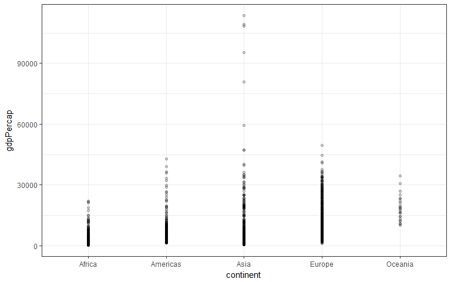

# HW03_rmd
DJames  
October 1, 2017  


## Downloading the Gapminder and Tidyverse packages


```r
library(gapminder)
library(tidyverse)
```

```
## Loading tidyverse: ggplot2
## Loading tidyverse: tibble
## Loading tidyverse: tidyr
## Loading tidyverse: readr
## Loading tidyverse: purrr
## Loading tidyverse: dplyr
```

```
## Conflicts with tidy packages ----------------------------------------------
```

```
## filter(): dplyr, stats
## lag():    dplyr, stats
```

## Exploring the Gapminder dataset

Let's check the overall strucure of the dataset, including overall (global) minimum and maximum GDP per capita:

```r
str(gapminder)
```

```
## Classes 'tbl_df', 'tbl' and 'data.frame':	1704 obs. of  6 variables:
##  $ country  : Factor w/ 142 levels "Afghanistan",..: 1 1 1 1 1 1 1 1 1 1 ...
##  $ continent: Factor w/ 5 levels "Africa","Americas",..: 3 3 3 3 3 3 3 3 3 3 ...
##  $ year     : int  1952 1957 1962 1967 1972 1977 1982 1987 1992 1997 ...
##  $ lifeExp  : num  28.8 30.3 32 34 36.1 ...
##  $ pop      : int  8425333 9240934 10267083 11537966 13079460 14880372 12881816 13867957 16317921 22227415 ...
##  $ gdpPercap: num  779 821 853 836 740 ...
```

```r
min(gapminder$gdpPercap)
```

```
## [1] 241.1659
```

```r
max(gapminder$gdpPercap)
```

```
## [1] 113523.1
```

Now let's get the minimum and maximum GDP per capita by continent using dplyr:

```r
my.df <- gapminder %>% group_by(continent) %>%
     summarize(min = min(gdpPercap),
               max = max(gdpPercap))
results = 'asis'
knitr::kable(my.df) #we can use knitr to try to structure the table a bit better.
```


continent           min         max
----------  -----------  ----------
Africa         241.1659    21951.21
Americas      1201.6372    42951.65
Asia           331.0000   113523.13
Europe         973.5332    49357.19
Oceania      10039.5956    34435.37
We can see that the global minimum GDP per capita can be attributed to Africa, while the maximum GDP per capita can be attributed to Asia.


```r
ggplot(gapminder, aes(continent, gdpPercap)) +
    geom_point(alpha=0.2) +
    geom_smooth(se=FALSE, span=0.5)
```

```
## `geom_smooth()` using method = 'loess'
```

<!-- -->


Obviously, we could calcualte the spread of GDP per capita within the continents manually based on the above information, or we could query the dataset further to do it for us:


```r
my.df2 <- gapminder %>% group_by(continent) %>%
     summarize(range = max(gdpPercap) - min(gdpPercap))
results = 'asis'
knitr::kable(my.df2)
```


continent        range
----------  ----------
Africa        21710.05
Americas      41750.02
Asia         113192.13
Europe        48383.66
Oceania       24395.77
Let's try to calculate weighted mean of life expectancy by poplation (borrowing code described by jaradniemi in [this thread](https://stackoverflow.com/questions/23502697/r-weighted-arithmetic-mean)):

```r
my.df3 <- gapminder %>%
   group_by(continent) %>%
  summarise(mean = mean(lifeExp), wmean = weighted.mean(lifeExp, pop))
results = 'asis'
knitr::kable(my.df3)
```


continent        mean      wmean
----------  ---------  ---------
Africa       48.86533   50.59279
Americas     64.65874   69.50691
Asia         60.06490   61.11856
Europe       71.90369   72.30718
Oceania      74.32621   75.48954

```r
ggplot(gapminder, aes(year, lifeExp, color=continent)) +
    geom_point() +
    geom_smooth(se=FALSE, span=0.5)
```

```
## `geom_smooth()` using method = 'loess'
```

<!-- -->

