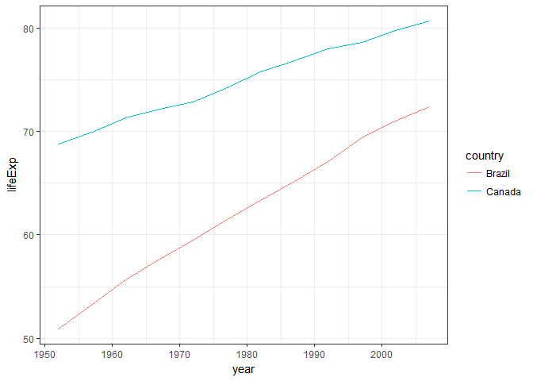
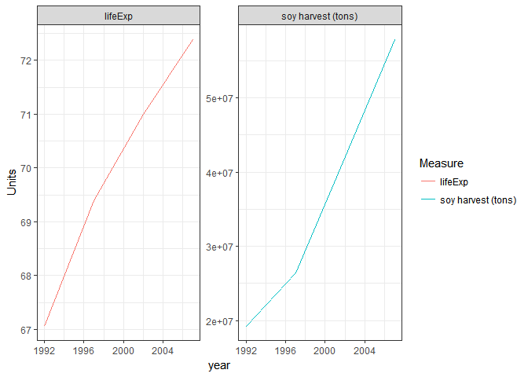

# HW04
DJames  
October 9, 2017  


## General data reshaping and relationship to aggregation

### Activity 2: Make a tibble with one row per year and columns for life expectancy for two or more countries.

First we need to load the gapminder and tidyverse packages.

```r
library(gapminder)
library(tidyverse)
```

```
## Loading tidyverse: ggplot2
## Loading tidyverse: tibble
## Loading tidyverse: tidyr
## Loading tidyverse: readr
## Loading tidyverse: purrr
## Loading tidyverse: dplyr
```

```
## Conflicts with tidy packages ----------------------------------------------
```

```
## filter(): dplyr, stats
## lag():    dplyr, stats
```

We can take a look at the summary of the gapminder data before diving in:

```r
summary(gapminder)
```

```
##         country        continent        year         lifeExp     
##  Afghanistan:  12   Africa  :624   Min.   :1952   Min.   :23.60  
##  Albania    :  12   Americas:300   1st Qu.:1966   1st Qu.:48.20  
##  Algeria    :  12   Asia    :396   Median :1980   Median :60.71  
##  Angola     :  12   Europe  :360   Mean   :1980   Mean   :59.47  
##  Argentina  :  12   Oceania : 24   3rd Qu.:1993   3rd Qu.:70.85  
##  Australia  :  12                  Max.   :2007   Max.   :82.60  
##  (Other)    :1632                                                
##       pop              gdpPercap       
##  Min.   :6.001e+04   Min.   :   241.2  
##  1st Qu.:2.794e+06   1st Qu.:  1202.1  
##  Median :7.024e+06   Median :  3531.8  
##  Mean   :2.960e+07   Mean   :  7215.3  
##  3rd Qu.:1.959e+07   3rd Qu.:  9325.5  
##  Max.   :1.319e+09   Max.   :113523.1  
## 
```

```r
str(gapminder)
```

```
## Classes 'tbl_df', 'tbl' and 'data.frame':	1704 obs. of  6 variables:
##  $ country  : Factor w/ 142 levels "Afghanistan",..: 1 1 1 1 1 1 1 1 1 1 ...
##  $ continent: Factor w/ 5 levels "Africa","Americas",..: 3 3 3 3 3 3 3 3 3 3 ...
##  $ year     : int  1952 1957 1962 1967 1972 1977 1982 1987 1992 1997 ...
##  $ lifeExp  : num  28.8 30.3 32 34 36.1 ...
##  $ pop      : int  8425333 9240934 10267083 11537966 13079460 14880372 12881816 13867957 16317921 22227415 ...
##  $ gdpPercap: num  779 821 853 836 740 ...
```

Let's filter for two countries, Brazil and Canada, and then select to only work with the country, year, and life expectancy for each:


```r
df_BRCA <- gapminder %>%
  filter(year, country=="Canada" | country=="Brazil") %>% 
  select(year, country, lifeExp)

df_BRCA
```

```
## # A tibble: 24 x 3
##     year country lifeExp
##    <int>  <fctr>   <dbl>
##  1  1952  Brazil  50.917
##  2  1957  Brazil  53.285
##  3  1962  Brazil  55.665
##  4  1967  Brazil  57.632
##  5  1972  Brazil  59.504
##  6  1977  Brazil  61.489
##  7  1982  Brazil  63.336
##  8  1987  Brazil  65.205
##  9  1992  Brazil  67.057
## 10  1997  Brazil  69.388
## # ... with 14 more rows
```

Let's use the spread function so that each country has its own column with life expectancy listed as the variable of interest underneath, according to year:

```r
df_BRCA_long <- df_BRCA %>% 
  spread(key = "country", value = "lifeExp")

df_BRCA_long
```

```
## # A tibble: 12 x 3
##     year Brazil Canada
##  * <int>  <dbl>  <dbl>
##  1  1952 50.917 68.750
##  2  1957 53.285 69.960
##  3  1962 55.665 71.300
##  4  1967 57.632 72.130
##  5  1972 59.504 72.880
##  6  1977 61.489 74.210
##  7  1982 63.336 75.760
##  8  1987 65.205 76.860
##  9  1992 67.057 77.950
## 10  1997 69.388 78.610
## 11  2002 71.006 79.770
## 12  2007 72.390 80.653
```

```r
#Tried to use knitr::kable() function to make the table more readable but something wasn't working right. Used default instead.
```

Now let's plot the life expectancies for each country against each other over time:

```r
ggplot(df_BRCA, aes(year, lifeExp)) +
  geom_line(aes(color=country)) +
  theme_bw()
```

<!-- -->

## Join, merge, look up

### Activity 1: Create a second data frame, complementary to Gapminder. Join this with (part of) Gapminder using a  dplyr join function and make some observations about the process and result. Explore the different types of joins:

I'm going to create a data.frame for Brazil's soy harvest over the past two decades, using it as a (bad) proxy for economic growth (which is a component of a country's development) in the country. Then we'll see how it relates to life expectancy over time.

```r
df_BRcensus <- "
country,soy harvest (tons),year
Brazil,19897804,1990
Brazil,14937806,1991
Brazil,19214705,1992
Brazil,22590978,1993
Brazil,24931832,1994
Brazil,25682637,1995
Brazil,23166874,1996
Brazil,26392636,1997
Brazil,31307440,1998
Brazil,30987476,1999
Brazil,32820826,2000
Brazil,37907259,2001
Brazil,42107618,2002
Brazil,51919440,2003
Brazil,49549941,2004
Brazil,51182074,2005
Brazil,52464640,2006
Brazil,57857172,2007
Brazil,59833105,2008
Brazil,57345382,2009
Brazil,68756343,2010
Brazil,74815447,2011
Brazil,65848857,2012
Brazil,81724477,2013
Brazil,86760520,2014
"

library(tidyverse)
df_BRcensus <- read_csv(df_BRcensus, trim_ws = TRUE, skip = 1)
```


Now let's join it with the Brazil/Canada subsetted data.frame created in the previous prompt from gapminder:

```r
str(df_BRCA)
```

```
## Classes 'tbl_df', 'tbl' and 'data.frame':	24 obs. of  3 variables:
##  $ year   : int  1952 1957 1962 1967 1972 1977 1982 1987 1992 1997 ...
##  $ country: Factor w/ 142 levels "Afghanistan",..: 15 15 15 15 15 15 15 15 15 15 ...
##  $ lifeExp: num  50.9 53.3 55.7 57.6 59.5 ...
```

```r
str(df_BRcensus)
```

```
## Classes 'tbl_df', 'tbl' and 'data.frame':	25 obs. of  3 variables:
##  $ country           : chr  "Brazil" "Brazil" "Brazil" "Brazil" ...
##  $ soy harvest (tons): int  19897804 14937806 19214705 22590978 24931832 25682637 23166874 26392636 31307440 30987476 ...
##  $ year              : int  1990 1991 1992 1993 1994 1995 1996 1997 1998 1999 ...
##  - attr(*, "spec")=List of 2
##   ..$ cols   :List of 3
##   .. ..$ country           : list()
##   .. .. ..- attr(*, "class")= chr  "collector_character" "collector"
##   .. ..$ soy harvest (tons): list()
##   .. .. ..- attr(*, "class")= chr  "collector_integer" "collector"
##   .. ..$ year              : list()
##   .. .. ..- attr(*, "class")= chr  "collector_integer" "collector"
##   ..$ default: list()
##   .. ..- attr(*, "class")= chr  "collector_guess" "collector"
##   ..- attr(*, "class")= chr "col_spec"
```

```r
# Need to convert the "year" column for df_BRcensus from character strings to integers
df_BRcensus <- df_BRcensus %>% 
  mutate(year=as.integer(year))
# Join the two data.frames together using inner join, with "year" as the common variable:
df.join <- inner_join(df_BRCA, df_BRcensus, by = "year")
# Filter to get results for only Brazil and delete redundant country column
df.join_filter <- df.join %>% 
  filter(country.x=="Brazil") %>% 
  select(-country.y)
```

Let's gather life expectancy and soy harvest together:

```r
df.join_filter_gather <- df.join_filter %>% 
  gather(key = "Measure", value = "Units", lifeExp:`soy harvest (tons)`)
```


Now let's plot the life expecancy of Brazil's population and the soy harvest against time:

```r
ggplot(df.join_filter_gather, aes(year, Units)) +
  geom_line(aes(color=Measure)) +
  facet_wrap(~ Measure, scales = "free_y") +
  theme_bw()
```

<!-- -->
Both of these measures of development have increased dramatically over the past two decades.
