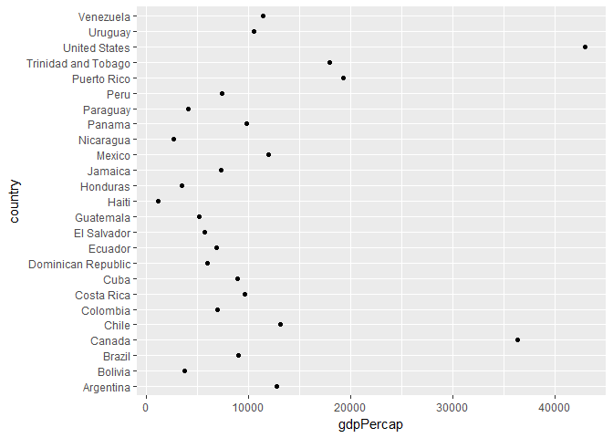
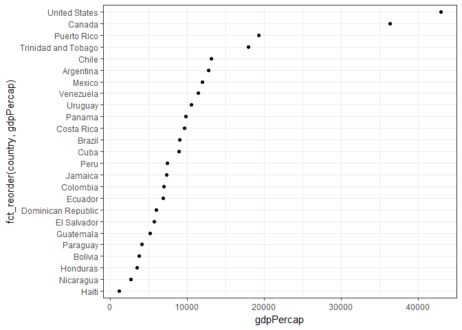
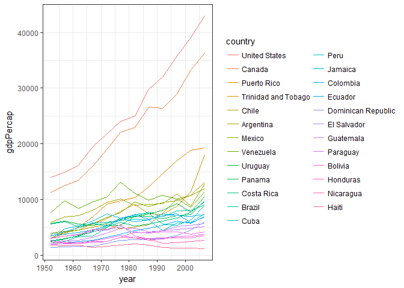

# HW05
DJames  
October 18, 2017  


## Factor management: Gapminder

Here we will define factor variables; drop factor / levels; and reorder levels based on knowledge from data. First, we need to load the gapminder data and the tidyverse package. While we're at it, we can also load the forcats and RColorBrewer packages.

```r
library(gapminder)
library(tidyverse)
```

```
## Warning: package 'tidyverse' was built under R version 3.4.2
```

```
## Loading tidyverse: ggplot2
## Loading tidyverse: tibble
## Loading tidyverse: tidyr
## Loading tidyverse: readr
## Loading tidyverse: purrr
## Loading tidyverse: dplyr
```

```
## Conflicts with tidy packages ----------------------------------------------
```

```
## filter(): dplyr, stats
## lag():    dplyr, stats
```

```r
library(forcats)
```

```
## Warning: package 'forcats' was built under R version 3.4.2
```

```r
library(RColorBrewer)
```


**Drop Oceania:** Filter the Gapminder data to remove observations associated with the continent of Oceania. Additionally, remove unused factor levels. Provide concrete information on the data before and after removing these rows and Oceania; address the number of rows and the levels of the affected factors.

```r
# It's good to first check the summary and structure of the original dataset
summary(gapminder)
```

```
##         country        continent        year         lifeExp     
##  Afghanistan:  12   Africa  :624   Min.   :1952   Min.   :23.60  
##  Albania    :  12   Americas:300   1st Qu.:1966   1st Qu.:48.20  
##  Algeria    :  12   Asia    :396   Median :1980   Median :60.71  
##  Angola     :  12   Europe  :360   Mean   :1980   Mean   :59.47  
##  Argentina  :  12   Oceania : 24   3rd Qu.:1993   3rd Qu.:70.85  
##  Australia  :  12                  Max.   :2007   Max.   :82.60  
##  (Other)    :1632                                                
##       pop              gdpPercap       
##  Min.   :6.001e+04   Min.   :   241.2  
##  1st Qu.:2.794e+06   1st Qu.:  1202.1  
##  Median :7.024e+06   Median :  3531.8  
##  Mean   :2.960e+07   Mean   :  7215.3  
##  3rd Qu.:1.959e+07   3rd Qu.:  9325.5  
##  Max.   :1.319e+09   Max.   :113523.1  
## 
```

```r
str(gapminder)
```

```
## Classes 'tbl_df', 'tbl' and 'data.frame':	1704 obs. of  6 variables:
##  $ country  : Factor w/ 142 levels "Afghanistan",..: 1 1 1 1 1 1 1 1 1 1 ...
##  $ continent: Factor w/ 5 levels "Africa","Americas",..: 3 3 3 3 3 3 3 3 3 3 ...
##  $ year     : int  1952 1957 1962 1967 1972 1977 1982 1987 1992 1997 ...
##  $ lifeExp  : num  28.8 30.3 32 34 36.1 ...
##  $ pop      : int  8425333 9240934 10267083 11537966 13079460 14880372 12881816 13867957 16317921 22227415 ...
##  $ gdpPercap: num  779 821 853 836 740 ...
```

```r
# We can also get a factor count using the forcats package
fct_count(gapminder$continent)
```

```
## # A tibble: 5 x 2
##          f     n
##     <fctr> <int>
## 1   Africa   624
## 2 Americas   300
## 3     Asia   396
## 4   Europe   360
## 5  Oceania    24
```

The original gapminder dataframe has 1704 observations.


```r
# We will keep the original dataframe intact, and assign a new dataframe to the object "subsetted_gf_df" where we filter out any observations where the continent = Oceania
subsetted_gf_df <- subset(gapminder, continent %in% c('Africa', 'Asia', 'Americas', 'Europe'))

# Let's make sure the levels are dropped
subsetted_gf_df$continent %>%
  fct_drop() %>%
  levels()
```

```
## [1] "Africa"   "Americas" "Asia"     "Europe"
```

```r
# Let's check the summary and structure for the new dataframe to ensure there are no longer observations for Oceania
summary(subsetted_gf_df)
```

```
##         country        continent        year         lifeExp     
##  Afghanistan:  12   Africa  :624   Min.   :1952   Min.   :23.60  
##  Albania    :  12   Americas:300   1st Qu.:1966   1st Qu.:48.08  
##  Algeria    :  12   Asia    :396   Median :1980   Median :60.34  
##  Angola     :  12   Europe  :360   Mean   :1980   Mean   :59.26  
##  Argentina  :  12   Oceania :  0   3rd Qu.:1993   3rd Qu.:70.75  
##  Austria    :  12                  Max.   :2007   Max.   :82.60  
##  (Other)    :1608                                                
##       pop              gdpPercap       
##  Min.   :6.001e+04   Min.   :   241.2  
##  1st Qu.:2.780e+06   1st Qu.:  1189.1  
##  Median :7.024e+06   Median :  3449.5  
##  Mean   :2.990e+07   Mean   :  7052.4  
##  3rd Qu.:1.987e+07   3rd Qu.:  8943.2  
##  Max.   :1.319e+09   Max.   :113523.1  
## 
```

```r
str(subsetted_gf_df)
```

```
## Classes 'tbl_df', 'tbl' and 'data.frame':	1680 obs. of  6 variables:
##  $ country  : Factor w/ 142 levels "Afghanistan",..: 1 1 1 1 1 1 1 1 1 1 ...
##  $ continent: Factor w/ 5 levels "Africa","Americas",..: 3 3 3 3 3 3 3 3 3 3 ...
##  $ year     : int  1952 1957 1962 1967 1972 1977 1982 1987 1992 1997 ...
##  $ lifeExp  : num  28.8 30.3 32 34 36.1 ...
##  $ pop      : int  8425333 9240934 10267083 11537966 13079460 14880372 12881816 13867957 16317921 22227415 ...
##  $ gdpPercap: num  779 821 853 836 740 ...
```

Now that we've filtered out any observations where the continent is 'Oceania', the number of observations has dropped to 1680. 

We can try to also filter out unused factor levels:


```r
subsetted_gf_df_2 <- subsetted_gf_df %>% 
  mutate(continent_factor = ifelse(is.na(continent),
                              "Missing_info",
                              continent))

continent_factor <- as_factor("continent_factor")

# Let's make sure the levels are dropped
gf_df_dropped <- subsetted_gf_df_2 %>% 
  droplevels()
nlevels(gf_df_dropped$continent)
```

```
## [1] 4
```

Let's check out the new dataframe's summary, structure and factor levels:


```r
summary(gf_df_dropped)
```

```
##         country        continent        year         lifeExp     
##  Afghanistan:  12   Africa  :624   Min.   :1952   Min.   :23.60  
##  Albania    :  12   Americas:300   1st Qu.:1966   1st Qu.:48.08  
##  Algeria    :  12   Asia    :396   Median :1980   Median :60.34  
##  Angola     :  12   Europe  :360   Mean   :1980   Mean   :59.26  
##  Argentina  :  12                  3rd Qu.:1993   3rd Qu.:70.75  
##  Austria    :  12                  Max.   :2007   Max.   :82.60  
##  (Other)    :1608                                                
##       pop              gdpPercap        continent_factor
##  Min.   :6.001e+04   Min.   :   241.2   Min.   :1.000   
##  1st Qu.:2.780e+06   1st Qu.:  1189.1   1st Qu.:1.000   
##  Median :7.024e+06   Median :  3449.5   Median :2.000   
##  Mean   :2.990e+07   Mean   :  7052.4   Mean   :2.293   
##  3rd Qu.:1.987e+07   3rd Qu.:  8943.2   3rd Qu.:3.000   
##  Max.   :1.319e+09   Max.   :113523.1   Max.   :4.000   
## 
```

```r
str(gf_df_dropped)
```

```
## Classes 'tbl_df', 'tbl' and 'data.frame':	1680 obs. of  7 variables:
##  $ country         : Factor w/ 140 levels "Afghanistan",..: 1 1 1 1 1 1 1 1 1 1 ...
##  $ continent       : Factor w/ 4 levels "Africa","Americas",..: 3 3 3 3 3 3 3 3 3 3 ...
##  $ year            : int  1952 1957 1962 1967 1972 1977 1982 1987 1992 1997 ...
##  $ lifeExp         : num  28.8 30.3 32 34 36.1 ...
##  $ pop             : int  8425333 9240934 10267083 11537966 13079460 14880372 12881816 13867957 16317921 22227415 ...
##  $ gdpPercap       : num  779 821 853 836 740 ...
##  $ continent_factor: int  3 3 3 3 3 3 3 3 3 3 ...
```

```r
nlevels(gf_df_dropped)
```

```
## [1] 0
```

**Reorder the levels of country or continent:** Use the forcats package to change the order of the factor levels, based on a principled summary of one of the quantitative variables. Consider experimenting with a summary statistic beyond the most basic choice of the median.

We can practice with reordering factor levels based simply on frequency of appearing in the dataframe:

```r
gf_df_dropped$continent %>% 
  fct_infreq() %>%
  levels() %>% head()
```

```
## [1] "Africa"   "Asia"     "Europe"   "Americas"
```

We can also reorder the continents based on minimum GDP per capita, and pull out the handful of countries with the lowest GDP per capita using head():

```r
fct_reorder(gf_df_dropped$country, gf_df_dropped$gdpPercap, min) %>% 
  levels() %>% 
  head()
```

```
## [1] "Congo, Dem. Rep." "Lesotho"          "Guinea-Bissau"   
## [4] "Eritrea"          "Myanmar"          "Burundi"
```

We can plot the factor levels in the given order for the Americas (alphabetical):


```r
hw5_1_plot <- gf_df_dropped %>% filter(year == 2007, continent == "Americas")
ggplot(hw5_1_plot, aes(x = gdpPercap, y = country)) + geom_point()
```

<!-- -->

...or we can plot based on the reordered factor levels for GDP per capita, which makes the graph more easily read:


```r
ggplot(hw5_1_plot, aes(x = gdpPercap, y = fct_reorder(country, gdpPercap))) +
  geom_point() +
  theme_bw()
```

<!-- -->

**Visualization Design:** Remake at least one figure or create a new one, in light of something you learned in the recent class meetings about visualization design and color.

Let's switch up the axes so that the x-axis is time, y-axis is GDP per capita, and color each trend line by country:


```r
hw5_2_plot <- gf_df_dropped %>% filter(continent == "Americas")
p <- ggplot(hw5_2_plot, aes(x = year, y = gdpPercap,
                  color = fct_reorder2(country, year, gdpPercap))) +
  geom_line() +
  labs(color = "country") +
  theme_bw() +
    scale_fill_manual(values=brewer.pal(n=5, "Dark2"))
```


```r
p
```

<!-- -->


**Writing figures to file**

Let's save the plot:


```r
ggsave("my_plot.png", p)
```

```
## Saving 7 x 5 in image
```

```r
ggsave("my_plot.pdf", p)
```

```
## Saving 7 x 5 in image
```

And re-embed it:


Unsure why, but my emdedded image is appearing in my knit to html document, but not in my rmd file in my repo.

**Clean the repo:**

Lastly, I've finally gone back to tidy up my repo for HW assignments, and strucured everything into folders.
